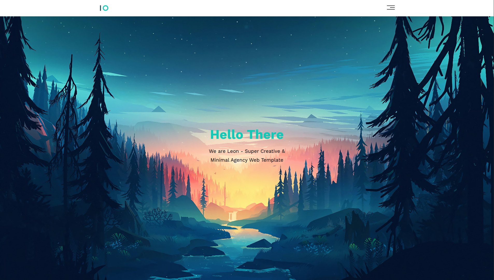

# 🌟 Personal Portfolio — Leon Template (HTML & CSS)


A custom personal portfolio website built using the **Leon Template**.  
Designed to present personal info, skills, and projects in a clean & minimal UI.

---

## 🚀 Live Demo

🔗 **Visit Portfolio:**  
https://tahaely.github.io/Personal-Portfolio-Leon-Template-HTML-CSS/

---

## 📸 Preview



---

## ✨ Features

- ✅ Fully responsive  
- ✅ Fast and lightweight  
- ✅ Modern & clean UI  
- ✅ About section  
- ✅ Skills & Services section  
- ✅ Portfolio / Projects showcase  
- ✅ Contact section  

---

## 🛠️ Technologies Used

- **HTML**
- **CSS**

---

## 📂 Project Structure

```
root/
 ├── index.html
 ├── css/
 ├── images/
 └── README.md
```

---

## 📦 Installation & Usage

```bash
# Clone the repository
git clone https://github.com/tahaely/Personal-Portfolio-Leon-Template-HTML-CSS.git

# Enter the folder
cd Personal-Portfolio-Leon-Template-HTML-CSS

# Open index.html in your browser
```

---

## 🧾 License

Based on the **Leon UI Template** by Graphberry (free & open source).  
You are allowed to modify and use it.

---

## 👤 Author

**Cheikh Ely**

🔗 GitHub: https://github.com/tahaely  

---

### ⭐ Support

If you like this project, consider giving it a **star ⭐ on GitHub** — Thank you! 😊